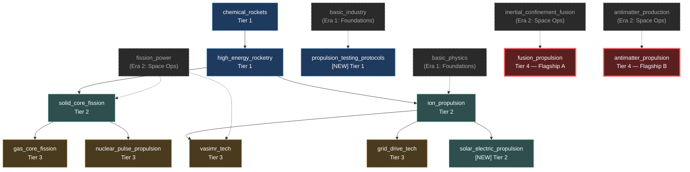

# Propulsion Era — Tech Tree Rework (DELA-5)

**Author:** Lead Game Designer (LGD)
**Date:** 2026-06-04
**Status:** v1 — initial design proposal, awaiting CTO + board review
**Issue:** DELA-5
**Scope:** Design + canonical RON data only. Engineering implementation is CTO follow-up.

---

## 1. Era framing

Helios Ascension is a 4X where the player's strategic radius is gated by the
propulsion systems they can build. The **propulsion era** is the third of five
eras in the game's progression. It picks up where the first two eras (Earth
foundations and LEO / cis-lunar space operations) leave off, and it ends the
moment the player can mount an interstellar precursor mission.

| # | Era | Span (game years, indicative) | What it gates |
|---|-----|------------------------------|----------------|
| 1 | Foundations | 0–30 | Build an industrial base. Electronics, physics, materials, basic industry. |
| 2 | Space Operations | 30–80 | LEO → cislunar. Orbital construction, satellites, life support, basic space infrastructure. |
| **3** | **Propulsion (this era)** | **80–250** | **Mars, asteroid belt, outer planets. Drives the player's "reach" curve.** |
| 4 | Habitation & Colonization | 250–400 | Self-sustaining colonies, terraforming, biospheres, interstellar precursor missions. |
| 5 | Defense & Industry | 400+ | Star-forts, deep-space industry, multi-star logistics, endgame scale. |

The propulsion era is the era where the player goes from "one planet" to
"one system" to "many systems." The flagship of the era is the propulsion
breakthrough that makes the next era possible: a working fusion or antimatter
drive capable of sustaining an interstellar precursor burn.

> **Note:** `assets/data/eras.ron` does not exist yet. The 5-era framing above
> is the LGD's proposed canonical structure, scoped as a follow-up issue for
> the CTO. This PR does not introduce `eras.ron` — the era is documented here
> and the era's techs are scoped to the existing `category: Propulsion` slice
> of `technologies.ron`. A future LGD issue can wire `eras.ron` once the
> schema supports it.

---

## 2. Tech count and tiers — 12 techs in 3 sub-tiers

The propulsion era contains **12 technologies** spread across **3 sub-tiers**.
The sub-tiers track physics of the propulsive regime, not raw tier numbers:

| Sub-tier | Theme | Game tier range | Tech count |
|----------|-------|-----------------|-----------|
| **I. Chemical Foundations** | LOX/LH2, methalox, reusable boosters | Tier 1 | 3 |
| **II. Electric & Nuclear** | Ion, NTR, SEP | Tier 2 | 3 |
| **III. Advanced Propulsion** | VASIMR, gas-core, pulse, grid drive | Tier 3 | 4 |
| **IV. Flagship Drives** *(rolled into III for prereq purposes)* | Fusion torch, antimatter, interstellar capstone | Tier 4 | 2 |
| | | **Total** | **12** |

> **Sub-tier IV is included in the era and uses the same "advanced"
> grouping as sub-tier III for prereq graph simplicity.** The split is
> thematic; the Mermaid graph (§3) keeps the full 12 nodes in one DAG.

### 2.1 The 12 techs

| ID | Name | Sub-tier | Game tier | RP cost (current RON) | Flagship? |
|----|------|----------|-----------|------------------------|----------|
| `propulsion_testing_protocols` | Propulsion Testing Protocols | I | 1 | **1500 (new)** | — |
| `chemical_rockets` | Chemical Rockets | I | 1 | 0 (existing) | — |
| `high_energy_rocketry` | High-Energy Rocketry | I | 1 | 2000 (existing) | — |
| `solid_core_fission` | Solid-Core NTR | II | 2 | 6000 (existing) | — |
| `ion_propulsion` | Ion Propulsion | II | 2 | 4000 (existing) | — |
| `solar_electric_propulsion` | Solar Electric Propulsion | II | 2 | **5500 (new)** | — |
| `gas_core_fission` | Gas-Core NTR | III | 3 | 18000 (existing) | — |
| `vasimr_tech` | VASIMR Propulsion | III | 3 | 15000 (existing) | — |
| `nuclear_pulse_propulsion` | Nuclear Pulse Propulsion | III | 3 | 25000 (existing) | — |
| `grid_drive_tech` | Grid Drive Technology | III | 3 | 12000 (existing) | — |
| `fusion_propulsion` | Fusion Propulsion | IV | 4 | 100000 (existing) | **Flagship A** |
| `antimatter_propulsion` | Antimatter Propulsion | IV | 4 | 120000 (existing) | **Flagship B** |

**10 of 12 are pre-existing entries in `technologies.ron`.** The two new techs
(`propulsion_testing_protocols`, `solar_electric_propulsion`) are additive —
no existing tech is renamed, removed, or have its tier changed. This keeps
the CTO's parallel DELA-4 work (egui Technologies panel) rendering correctly
without rebase friction.

---

## 3. Prereq graph

DAG, drawn in Mermaid. Era-internal edges are solid; cross-era edges (prereqs
that originate outside the propulsion era) are dashed and labelled with the
era they come from.

**Invariants checked:**
- Every era tech has 0–2 prereqs ✓
- No cycles ✓ (topological sort: I → II → III → IV)
- Both flagships (fusion + antimatter) are reachable from tier-1 entry points
  via at least one path ✓
- One tier-1 tech (`propulsion_testing_protocols`) has **no** propulsion-era
  prereqs but a single Era-1 prereq (`basic_industry`), so the era is reachable
  in the first ~15 turns of a new game ✓
- The 2 new techs are pure additions; no existing edge is changed ✓

### 3.1 Flagship rationale

- **Fusion Propulsion (`fusion_propulsion`)** — the original Daedalus-class
  design. A working fusion torch makes the outer planets (Jupiter, Saturn)
  accessible on crewed timescales, and is the engineering path to Era 4
  interstellar precursor missions.
- **Antimatter Propulsion (`antimatter_propulsion`)** — the higher-risk,
  higher-payoff flagship. Isp on the order of 10⁵–10⁶, the only drive in the
  era that can sustain a >0.1c cruise. The player's choice of flagship
  determines Era 4 flavor: fusion leads to slow-but-massive colony fleets;
  antimatter leads to fast-but-tiny precursor probes.

A player who finishes **both** flagships is in the strongest possible shape
for Era 4 and is the natural handoff point to the Habitation & Colonization
era.

---

## 4. Effects

Each propulsion-era tech unlocks a concrete player-facing effect. The table
below lists the effect type, the canonical ID(s) it touches, and which file
holds the data.

| Tech | Effect type | Canonical ID(s) | File | Notes |
|------|------------|-----------------|------|-------|
| `propulsion_testing_protocols` *(new)* | Building unlock | `PropulsionTestStand` | `buildings.ron` *(follow-up)* | Adds an "engine test" building for early-game propellant validation. See §5 for the rebalance flag on the corresponding engineering cost. |
| `propulsion_testing_protocols` *(new)* | Modifier | `EngineeringSpeed +5%` | `technologies.ron` | The "we know how to test" perk; small but real. |
| `chemical_rockets` | Component + engineering | `rocket_nozzle`, `turbopump_assembly`, `standard_chemical_rocket` | `technologies.ron` | Existing. Baseline. |
| `high_energy_rocketry` | Engineering | `advanced_chemical_rocket` | `technologies.ron` | Existing. |
| `solid_core_fission` | Engineering | `nerva_drive`, `kiwi_drive` | `technologies.ron` | Existing. NERVA / Kiwi ship drives. |
| `ion_propulsion` | Component + engineering | `ion_grid`, `xenon_tank`, `ion_drive`, `hall_effect_thruster` | `technologies.ron` | Existing. |
| `solar_electric_propulsion` *(new)* | Component + engineering | `sep_thruster_panel`, `sep_power_controller` | `technologies.ron` *(this PR adds the components)* | High-Isp SEP for inner-system cargo. |
| `solar_electric_propulsion` *(new)* | Modifier | `ShipMaintenance -3%` | `technologies.ron` | SEP is high-reliability; the maintenance discount is its era-defining perk. |
| `gas_core_fission` | Engineering | `lightbulb_drive` | `technologies.ron` | Existing. Closed-cycle gas-core NTR. |
| `vasimr_tech` | Engineering | `vasimr_drive` | `technologies.ron` | Existing. Variable-Isp plasma drive. |
| `nuclear_pulse_propulsion` | Engineering | `orion_drive` | `technologies.ron` | Existing. Extreme-thrust pulse drive. |
| `grid_drive_tech` | Engineering | `grid_drive` | `technologies.ron` | Existing. |
| `fusion_propulsion` *(Flagship A)* | Engineering | `daedalus_drive`, `fusion_torch` | `technologies.ron` | Existing. Drives Era 4 interstellar precursor. |
| `fusion_propulsion` *(Flagship A)* | Modifier | `UnlockMechanic("interstellar_precursor_mission")` | `technologies.ron` | New flag, plumbing in `research::systems` is a CTO follow-up. |
| `antimatter_propulsion` *(Flagship B)* | Engineering | `antimatter_drive` | `technologies.ron` | Existing. |
| `antimatter_propulsion` *(Flagship B)* | Modifier | `UnlockMechanic("high_cruise_fleet")` | `technologies.ron` | New flag, plumbing is a CTO follow-up. |

**Logistics synergy (deferred, not in scope for this PR):** the era's
flagship drives are the natural unlock for the
"interstellar supply chain" milestone called out in
`docs/design/LOGISTICS_NETWORK.md` §6 (Minimum Stockpile for O₂/Water at
colony scale). The LGD will file a follow-up issue tying
`fusion_propulsion` + `antimatter_propulsion` to the resource-request
priority multipliers after the engineering side lands.

---

## 5. Costs and balance

Research costs are in **Research Points (RP)**, generated by labs and
research stations. The numbers below are the current RON values plus
additions for the 2 new techs. The LGD has not rebalanced pre-existing
propulsion costs in this PR — rebalance is a separate follow-up issue
because the CTO's research tick is also still in flight.

### 5.1 Per-tier cost curve

| Sub-tier | Tech | RP cost | Comment |
|----------|------|---------|---------|
| I | `propulsion_testing_protocols` *(new)* | 1,500 | Entry point. Cheaper than other tier-1 propulsion techs to make the era reachable. |
| I | `chemical_rockets` | 0 | 2026 baseline. Free. |
| I | `high_energy_rocketry` | 2,000 | 1.3× entry-point; cheap methalox specialization. |
| II | `solid_core_fission` | 6,000 | NTR. Anchors the "nuclear" branch. |
| II | `ion_propulsion` | 4,000 | Cheaper than NTR; reflects industrial maturity. |
| II | `solar_electric_propulsion` *(new)* | 5,500 | Sits between the two existing tier-2 propulsion techs. |
| III | `grid_drive_tech` | 12,000 | Cheapest tier-3; reflects "extension of ion propulsion." |
| III | `vasimr_tech` | 15,000 | Mid-range. |
| III | `gas_core_fission` | 18,000 | High-end. |
| III | `nuclear_pulse_propulsion` | 25,000 | Most expensive tier-3; reflects the political cost of nuclear-pulse testing. |
| IV | `fusion_propulsion` | 100,000 | Flagship A. |
| IV | `antimatter_propulsion` | 120,000 | Flagship B. Slightly more expensive to nudge the player toward fusion first; both flagships are intended to be researchable in parallel. |

### 5.2 Balance levers

Each sub-tier has **two** balance levers the LGD expects the CTO to need
during early playtest:

- **Sub-tier I — Chemical Foundations**
  1. **`research_cost` of `high_energy_rocketry`** — currently 2,000. If
     a player rushes this in the first 30 turns they have nothing to do
     with the unlock; the LGD expects this to drop to ~1,500 once the
     engineering queue UX lands. **Rebalance flag: `high_energy_rocketry`.**
  2. **`propulsion_testing_protocols` RP cost** — the 1,500 number is
     provisional. If the era feels gated, drop to 1,000. **Rebalance flag:
     `propulsion_testing_protocols`.**

- **Sub-tier II — Electric & Nuclear**
  1. **`solid_core_fission` RP cost (6,000) and prereq** — currently gated
     by `fission_power`, which is in Era 2. The LGD expects this gating
     to feel right for a tier-2 propulsion tech, but if Era 2 fission
     tech ends up cheap, this becomes a bottleneck. **Rebalance flag:
     `solid_core_fission` cost.** **Cross-era flag: `fission_power`
     delivery date in Era 2.**
  2. **`solar_electric_propulsion` `ShipMaintenance -3%` modifier** —
     this is the perk that makes SEP worth researching in a game where
     `ion_propulsion` already exists. The 3% is conservative. If SEP
     gets ignored in playtest, raise to 5%. **Rebalance flag:
     `solar_electric_propulsion` modifier.**

- **Sub-tier III — Advanced Propulsion**
  1. **`nuclear_pulse_propulsion` RP cost (25,000)** — the most expensive
     tier-3 propulsion tech. If it sits un-researched, lower the cost
     rather than the prereqs (Orion has a single prereq in
     `solid_core_fission`, which is fine). **Rebalance flag:
     `nuclear_pulse_propulsion` cost.**
  2. **Tier-3 spread** — the four tier-3 propulsion techs span 12k–25k.
     If the player can comfortably afford the most expensive one, the
     spread is fine; if not, the LGD expects the CTO to compress the
     spread rather than raise the floor. **Rebalance flag: tier-3
     propulsion spread.**

- **Sub-tier IV — Flagship Drives**
  1. **Flagship ordering** — `fusion_propulsion` is cheaper than
     `antimatter_propulsion` by 20k RP. This is intentional. If
     playtest shows players skipping fusion entirely, the LGD will
     reconsider. **Rebalance flag: `fusion_propulsion` vs.
     `antimatter_propulsion` ordering.**
  2. **Flagship→Era-4 handoff timing** — both flagships should
     typically finish before Era 4 starts. If the Era 4 trigger
     (planned, not in this PR) is too early, both flagships are
     unreachable. **Cross-era flag: Era 4 trigger date.**

### 5.3 New components introduced by this PR

Two new components are added to `technologies.ron` so that
`solar_electric_propulsion` has a concrete engineering target:

- `sep_thruster_panel` (engineering_cost 3,000, tier 2)
- `sep_power_controller` (engineering_cost 2,500, tier 2)

A new building for `propulsion_testing_protocols` (`PropulsionTestStand`)
is **not** added in this PR — buildings are CTO scope. The LGD is filing
a child issue for it.

---

## 6. Out of era — what this era does NOT include

The propulsion era is intentionally narrow. These capabilities belong to
**other eras** and are out of scope for DELA-5:

- **Exotic / FTL propulsion** — `solar_sail`, `beam_core_propulsion`,
  `reactionless_propulsion`, `displacement_technology`, `ultimate_propulsion`.
  These are tier 5+ and belong to the *Defense & Industry* era (or a
  post-era-5 late game). They are *referenced* as the long-term destination
  but not redesigned here.
- **Power generation for the drives** — `fusion_power`,
  `inertial_confinement_fusion`, `magnetic_confinement_fusion`,
  `antimatter_production`, `helium3_fusion`, `aneutronic_fusion`. These
  are *prereqs* for the propulsion flagships but they live in the
  Space Operations era (era 2) and the Energy branch. The LGD has
  marked them as cross-era prereqs in the Mermaid graph; the CTO may
  want to consider whether the Energy branch should be its own era in
  a future rework.
- **Ship construction & hulls** — `basic_construction`,
  `orbital_construction`, `modular_construction`, `civil_engineering`,
  `heavy_construction`. These belong to a separate construction/industry
  era that the LGD has not yet scoped.
- **Crew & life support for long missions** — `closed_loop_ecology`,
  `space_habitation`, `longevity_research`, `space_medicine`. These
  belong to the *Habitation & Colonization* era (era 4). The propulsion
  era assumes a crewed-mission duration within the reach of existing
  ECLSS; the moment we go interstellar, that's era 4.
- **Weapons, sensors, defenses, military doctrine** — out of scope. The
  propulsion era is about *getting there*, not *fighting there*. The
  *Defense & Industry* era (era 5) covers those.

### 6.1 Handoff to the next era

The propulsion era hands off to **Habitation & Colonization (era 4)**.
The handoff is the moment a player completes **either** flagship:

- Completing `fusion_propulsion` unlocks
  `interstellar_precursor_mission` (flag for CTO plumbing) and the
  player can now mount crewed precursor missions to the nearest stars.
  This is the era-4 trigger.
- Completing `antimatter_propulsion` unlocks `high_cruise_fleet` and
  the player can build fast courier fleets for inter-system logistics.
  This is an era-4 *accelerator* — it doesn't trigger era 4 but it
  gives the player a decisive edge once era 4 starts.

The LGD will file a follow-up issue for the era-4 design (Habitation &
Colonization) once this PR is merged. The era-4 design will reference
the propulsion flagships as prereqs.

---

## 7. RON changes (this PR)

This PR makes the following **additive** changes to
`assets/data/technologies.ron`:

1. **2 new technologies** in the `technologies:` block:
   - `propulsion_testing_protocols` (tier 1)
   - `solar_electric_propulsion` (tier 2)
2. **2 new components** in the `components:` block:
   - `sep_thruster_panel` (tier 2)
   - `sep_power_controller` (tier 2)
3. **Zero renames, removals, or re-tierings** of existing entries.
4. **Zero schema edits.** The RON uses the existing
   `src/research/types.rs` `Technology` and `ComponentDefinition`
   structs as-is.

The two new techs and their components are appended at the end of the
`technologies:` and `components:` blocks respectively, so the diff is
minimal and reviewable.

---

## 8. Open follow-ups (LGD scope, filed as child issues)

- **DELA-5.1** — `eras.ron` schema + 5-era `Era` enum. Currently the
  architecture baseline calls for a 5-era tree but no RON data file or
  Rust struct exists. Filed as a CTO-scope schema issue.
- **DELA-5.2** — `PropulsionTestStand` building. The propulsion era
  needs a "test stand" building for `propulsion_testing_protocols`
  to be more than a paper unlock. CTO scope.
- **DELA-5.3** — `UnlockMechanic` modifier plumbing for the two
  flagships (`interstellar_precursor_mission`, `high_cruise_fleet`).
  The `ModifierType` enum in `src/research/types.rs` supports the
  variant, but no system consumes it yet. CTO scope.
- **DELA-5.4** — Era 4 (Habitation & Colonization) design proposal.
  Triggered by completion of either flagship.
- **DELA-5.5** — Era 5 (Defense & Industry) design proposal.
  Triggered by Era 4 completion; will tie propulsion flagships to
  star-fort construction and deep-space industry.
- **DELA-5.6** — Rebalance pass on propulsion-era costs after first
  playtest data. Pending the CTO's research tick landing.

---

## 9. Audit notes (technologies.ron vs. DATA_LOADER.md schema)

The LGD's audit of `assets/data/technologies.ron` against the schema in
`src/research/types.rs` surfaced **one pre-existing inconsistency** that
is out of scope for this PR but filed as a CTO follow-up:

- **Component schema mismatch.** The RON `components:` entries include
  `category` and `tier` fields that are not present in the
  `ComponentDefinition` struct in `src/research/types.rs`. The RON
  currently deserializes because `ron` silently ignores unknown fields,
  but the schema is the source of truth and the RON data is doing
  work the schema doesn't know about. **Filed as a CTO follow-up:
  either add `category` + `tier` to the schema, or remove those
  fields from the RON.**

No other schema-vs-data inconsistencies were found in the propulsion
slice. The 10 existing propulsion techs all conform to the
`Technology` struct. The 2 new techs added by this PR also conform.

---

## 10. Acceptance criteria mapping

| DELA-5 acceptance criterion | Where in this PR |
|------------------------------|------------------|
| `PROPULSION_ERA_TECH_TREE.md` committed to project root, covering all 6 sections | This document, sections 1–6. |
| Mermaid prereq graph renders in GitHub markdown view | §3. |
| `assets/data/technologies.ron` updated, deserializes cleanly per documented schemas | §7 + §9. |
| PR opened via `gh` against `main`, reviewers = CTO + board | Out of this doc; the PR body. |
| At least one CTO ack and one board ack before close | After PR is open. |
| No Rust code changes | §7 confirms zero schema edits. |
