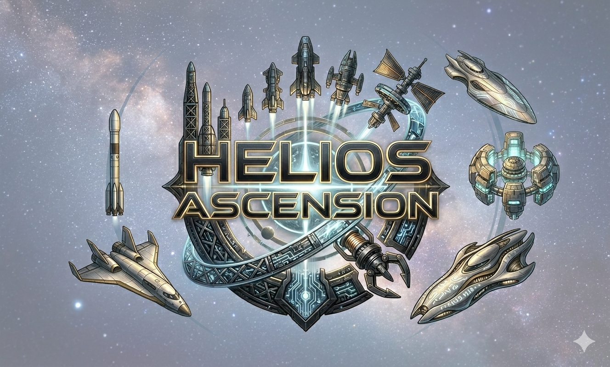

# Helios-Ascension
A 4X grand strategy game with realistic orbital mechanics and a big focus on resource management, logistics and research. Climb the Kardashev scale starting at 0.7 and expand your civilization across the stars!



## Current Status: v0.5.x — Playable single-system foundation 🟡 IN FLIGHT

The repository is ahead of the original v0.5 roadmap snapshot. The core single-system loop is playable: survey bodies, build colonies, mine and consume physical resources, move freight, research technologies, design ships, and plan analytic orbital transfers. The survey rework, personnel roster UI, notification/event system, save/load pipeline, asteroid presentation, and resource depletion forecasting are now present on `main`. Interstellar bodies are still represented by nearby-star data plus procedural fallback; the NASA exoplanet CSV is not loaded at runtime. AI factions, diplomacy, combat, cross-system logistics, and late-game Kardashev mechanics remain future work. See `ROADMAP.md` for the verified scope and next milestones.

## Features

### Core Game Systems

- **Colony Management**: Establish and manage colonies across the solar system
  - **52 building types** across 8 categories (Infrastructure, Industry, Logistics, Power, Population, Research, Financial, Military)
  - Each building has meaningful civilisation-scale output (e.g. Housing Complex = 25M residents, Farm = 1,000 Mt/yr food for ~10M people) — calibrated so a single Earth building ≈ the 2026 world production total for its dominant resource
  - **Building tiers with upgrade paths**, **synergies** between related buildings, and **atmosphere-availability** filtering for cross-atmosphere buildings
  - Construction cards show green effect lines so players know exactly what each building does
  - Construction queue system with resource costs and build times
  - Workforce allocation and efficiency management
  - Population growth and housing systems
  - Building maintenance and operating costs (4–6 distinct resources per building, audited)
  - **Orbital Survey Station** (v0.5.0): continuous low-yield survey of the host body with tiered mining-yield bonus (5/10/15% at tier 1/2/3)

- **Economy & Resources**: Deep resource management with real scarcity
  - **38 resource types**: Volatiles, atmospheric gases, construction & specialty metals, fissiles, fusion fuels, anti-matter, computronium, and metamaterials (late-game)
  - **Per-body resource stockpiles** — every colonised body, ship, and station has its own local stockpile; the UI shows aggregated system-wide totals for visibility, but construction and consumption draw locally
  - Mining operations to extract resources from celestial bodies
  - **Resource request system** with priority tiers (Emergency → Construction → Maintenance → Trade)
  - **Per-colony minimum stockpile editor** with in-transit ETA — defaults O₂ = 200 Mt, Water = 100 Mt on Life Support bodies
  - **Per-trip freight cap** — a fleet's cargo capacity caps a single delivery; remainder is left on the queue for the next trip
  - Treasury management with income and expenses
  - Energy grid with power generation (solar, fission, fusion, breeder, thorium, wind, hydro, geothermal, fossil) and distribution

- **Logistics & Shipping**: Move materials between bodies
  - **Player-directed freight** — assign a Freighter fleet to a resource request from the Fleet panel; arrival auto-delivers and closes the request
  - **Private shipping companies** — AI-controlled freighter fleets that scan open requests, dispatch their nearest freighter, and bid on your credits (default: one company with 2–3 chemical freighters at Earth)
  - **Freighter template system** — light / mid / heavy freighter hulls with cargo-bay-derived capacity, data-driven in `assets/data/ship_hulls.ron`
  - **Company freighter construction** — companies reinvest profits and order new hulls from your shipyards
  - **Private shipping overview subpanel** — registry of companies, active routes, treasury, ship counts
  - **In-transit filter** in the Fleet panel to show only freighters currently hauling cargo

- **Fleet Management & Orbital Mechanics**: Command fleets across the solar system
  - **7 ship classes**: Courier, Frigate, Destroyer, Cruiser, Research Vessel, Freighter, Station
  - **6 propulsion types**: Chemical (450 s Isp), Nuclear Thermal (900 s), Ion Drive (5 000 s), Nuclear Pulse (10 000 s), Fusion Torch (50 000 s), Antimatter Drive (1 000 000 s)
  - Realistic Tsiolkovsky rocket-equation Δv and fuel calculations per ship
  - **3 transfer options** per route: efficient Hohmann, moderate, and fast burns
  - **Porkchop plot planner** (v0.5.0): Δv / phase-angle grid with interactive cursor, synodic-period sweep, deferred-build cache for non-click entries, and tooltip-driven hover/selection
  - Transfer window planner: live synodic-period countdown and phase-angle display
  - Phased departure planning — adjust departure time to hit the optimal window
  - **Gravity-assist flyby candidates** automatically computed for each heliocentric transfer
  - **Lagrange-point targeting** (L4/L5 for any planet, Sun–planet L1/L2/L3) with interactive star-approach parking-radius picker
  - Fleet intercept planning with configurable passing distance and encounter speed
  - Mid-transit course-correction with abort-burn fuel deduction
  - Refuelling from planetary stockpiles
  - Visual trajectory arcs, orbit rings, selection reticules, and starmap icons
  - **5-ship Day-1 constellation** spawned at the 2026-01-01 JPL epoch

- **Research & Technology**: Unlock new capabilities through scientific advancement
  - **15 technology categories**: Electronics, Military, SpaceTechnology, Biology, Physics, Energy, Sociology, Construction, Propulsion, Materials, Sensors, Weapons, DefensiveSystems, LifeSupport, Industry
  - Technology tree with prerequisites and unlocks
  - Research projects progressing with research points (RP)
  - Engineering projects for component and ship-module families
  - Tech modifiers affecting construction costs and productivity
  - **9 v0.5.0 survey / personnel / geology techs** (Survey Methodology, Planetary Geology, Geophysics, Field Science Operations, Cryogenic Sampling, Deep Seismic Array, Roving Autonomy, Sample Return Architecture, Interstellar Probe)
  - **Tier-1 paid research_cost** (GRA-127 rebalance): early-game techs cost real RP, no free starts

- **Survey & Exploration (v0.5.0)**: Multi-instrument discovery campaigns
  - **Eight-dimension discovery model** (Orbital mechanics, Atmosphere, Surface features, Mineral classes, Mineral deposits, Subsurface structure, Habitability, Anomalies) — each with tier 0–5 and a confidence score
  - **9-mission roster** (flyby probe, orbital satellite, remote sensing, atmospheric probe, surface lander, rover, seismic survey, drill core, sample return) dispatched from the dossier `SURVEY` tab
  - **17 RON-driven instruments** plus **9 hardcoded anomaly types** (water-ice deposit, hydrated silicates, methane plume, tholin signature, magnetic anomaly, radioactive hotspot, fossil microbe signature, cryovolcanic feature, unidentified reflectance)
  - **Anomaly confidence model** with verification follow-up, media-event coolness, and 10–60 sim-day timers
  - **Failure modes and recovery missions** (probe loss, rover stuck, drill bit stuck, solar storm, crew injury) with per-mission RON templates
  - **Landing-site evaluation** — per-site terrain, resource, and risk profile (PR-D)
  - **Continuous orbital survey station** (PR-E) — mining-yield bonus 5/10/15% at tier 1/2/3
  - **Confidence decay** (0.5%/sim-year without measurements) rewards ongoing presence over one-shot missions

- **Personnel (v0.5.x, shipped)**
  - **Scientist component** with **8 specialties** (Geology, Atmospherics, Biology, Geophysics, …) and **3 seniority tiers** (Junior, Senior, Principal)
  - Specialty → analysis-job multiplier (matched ×1.5, mismatched ×0.7); seniority → throughput & quality
  - **Seniority promotion** driven by completed analysis jobs
  - **Personnel cap** gated by tech (`scientific_administration`), soft-capped with 5%/scientist penalty
  - **University** building produces scientists (~1 junior per 5 sim-years)
  - **Personnel roster UI** with sorting, pagination, specialty/seniority/status display, hire dialog, assignment view, and optional auto-assignment

- **Notifications & Event System (v0.5.0, shipped)**
  - **Toast-style HUD overlay** (top-right) with auto-dismiss + click-dismiss + pause-on-event
  - **2-second coalesce window** deduplicates rapid-fire identical events
  - **Per-category settings** (Survey, Construction, Research, …) in a dedicated settings panel
  - **Click-to-focus dispatcher** jumps the player to the relevant context (body, fleet, project)
  - **Bridges** auto-emit notifications for survey findings, construction completion, and research unlocks

- **Comprehensive Solar System Simulation**:
  - **377 celestial bodies** with realistic astronomical data from NASA/IAU sources
  - Complete planetary systems:
    - All 8 planets with accurate properties
    - **148 moons** including all major and many minor moons
    - Jupiter's complete 79-moon system
    - Saturn's complete 83-moon system
    - All Uranus (27) and Neptune (14) moons
  - **145 asteroids**:
    - Main belt comprehensive catalog
    - 30 Jupiter Trojans (L4 and L5 groups)
    - 17 Near-Earth Objects (mission targets)
  - **55 Kuiper Belt Objects** including Pluto, Eris, and scattered disc
  - **20 comets** including Halley, Hale-Bopp, and other famous visitors
  - Accurate masses, radii, and orbital parameters for all bodies
  - Real orbital mechanics with time-accelerated simulation (up to 1 year/second)
  - Complete coverage from Mercury to the outer solar system

- **Interstellar Navigation**: Explore nearby star systems
  - **60+ nearest star systems** from real astronomical catalogs (NASA Exoplanet Archive)
  - Starmap view for interstellar navigation
  - Real star data including spectral types, masses, luminosities, and metallicities
  - **Confirmed exoplanets** module (`src/astronomy/exoplanets.rs`) — `ConfirmedPlanet` struct + `RealPlanet` marker are staged; CSV ingestion from `Exoplanets_NASA.csv` is deferred to v0.6 (see `assets/data/README.md`); procedural fallback covers systems without confirmed planets today
  - Procedural system generation for visited stars
  - **Interstellar probe** tech (tier 5) unlocks flyby of bodies in other star systems

### User Interface

- **Comprehensive UI Panels**:
  - Dossier Panel (Survey tab + Construction tab + Resource ledger + Landing-site dossier + 8-dimension SURVEY ledger): per-body data
  - Construction Panel: Building management and construction queues, **yield chip & depletion timeline**, atmospheric-availability filter. **Native Bevy UI** (v0.5.2 canary) — built on the shared `src/ui/widgets.rs` primitive library and the `src/ui/bevy_theme.rs` palette mirror.
  - Research Panel: Technology tree browser, project selection, **engineering unlocks** (egui)
  - Economy Panel: Financial overview and resource tracking (egui)
  - **Logistics Panel** (top-level): open `ResourceRequest`s, in-transit shipments, shipping-company registry, per-colony minimum-stockpile editor
  - Starmap Panel: Interstellar navigation and system selection, **system-wide SURVEY %**
  - Fleet Panel: Full fleet management — spawn fleets, select transfer options, **porkchop plot planner**, gravity assists, **Lagrange-point routing (L1–L5 + star-approach parking-radius picker)**, refuel, abort maneuvers, and **assign a fleet to a resource request**
  - Shipbuilding Panel: Native Bevy workspace for hull design, engineering-linked component selection, construction queueing, archive review, and **freighter template selection**
  - **Notifications overlay**: top-right toast panel + dedicated settings modal
  - **Save / Load Panels**: named slots, overwrite confirmation, previews/thumbnails, metadata, explicit load confirmation, deletion, in-game return flow, and rolling autosaves
  - **Personnel Panel**: scientist roster, hiring, sorting/pagination, assignments, seniority and specialty display, and auto-assignment
  - **Intel Panel**: early-game milestone progress is exposed as a dedicated Intel submenu
  - **Economy Forecast**: resource-by-resource 20-year depletion/growth projections, reserve caps, and resource-bar previews/popups

- **Time Control**: Variable simulation speed (1 day/s to 1 year/s)
- **Debug Inspector**: Integrated inspector using bevy_inspector_egui for runtime entity inspection

### Technical Features

- **Atmospheric Scattering**: Real-time single-scattering Rayleigh + Mie shader on all bodies with atmospheres
  - Physically-derived parameters (scale height, Rayleigh tint, Mie haze) from gas composition data
  - RON overrides for Earth (blue limb glow), Mars (reddish dust), Venus (thick yellow-white), Titan (amber haze)
  - Correct layer ordering: surface → night lights → cloud deck → scattering shell
- **High-Performance Foundation**: Built with Bevy 0.18 engine with optimized compilation profiles
- **Modular Plugin Architecture**: Extensible plugin system for game systems
- **Advanced Camera Controls**:
  - WASD for movement
  - Q/E for vertical movement
  - Right-click drag for camera rotation
  - Mouse wheel for zoom
  - Automatic system ↔ starmap view transitions

## System Requirements

### Linux (Debian / Ubuntu)
```bash
# Required for running the game with graphics
sudo apt-get install libwayland-dev libxkbcommon-dev libvulkan-dev libasound2-dev libudev-dev

# Required for optimized build performance (LLD linker)
# Without this, builds will fail on Linux due to .cargo/config.toml configuration
sudo apt-get install lld clang
```

### Linux (Arch / Arch-based)
```bash
# Required for running the game with graphics
sudo pacman -Syu --needed \
  wayland \
  libxkbcommon \
  vulkan-icd-loader \
  alsa-lib \
  libx11 \
  libxrandr \
  libxinerama \
  libxcursor \
  libxi \
  libglvnd

# NOTE: libudev is provided by systemd and does not need a separate package.

# Required for optimized build performance (LLD linker)
sudo pacman -S --needed lld clang
```

### macOS / Windows
No additional system requirements - uses default system linkers.

## Building and Running

The project is configured with optimizations for fast compilation:
- **LLD linker** (Linux only): 2-5x faster linking than GNU ld
- **Parallel compilation**: Uses all available CPU cores automatically
- **Optimized test profile**: Faster test compilation

### Debug Build
```bash
cargo build
cargo run
```

### Release Build (Optimized)
```bash
cargo build --release
cargo run --release
```

### Fast Build Profile (Pre-configured, for rapid iteration)
```bash
cargo build --profile fast
cargo run --profile fast
```

### Testing

Run tests with standard cargo:
```bash
cargo test
```

Or use cargo-nextest for faster parallel test execution:
```bash
# Install cargo-nextest (one-time setup)
cargo install cargo-nextest

# Run tests in parallel
cargo nextest run
```

## Project Structure

```
helios_ascension/
├── src/
│   ├── main.rs              # Application entry point
│   ├── lib.rs               # Library root
│   ├── game_state.rs        # Top-level menu and launch state types
│   ├── astronomy/           # Orbital mechanics, ephemeris, exoplanets, nearby stars, Lagrange helpers
│   ├── colony/              # Colony management, buildings, construction, founding flow
│   ├── economy/             # Resources, budget, energy grid, logistics, AI shipping companies, mining
│   ├── fleets/              # Fleet management, orbital mechanics, porkchop, Lagrange transfers
│   ├── personnel/           # Scientists, hiring, promotion, assignments
│   ├── research/            # Technology tree, engineering, and unlock catalogs
│   ├── shipbuilding/        # Data-driven hulls, modules, projects, refit, and slipways
│   ├── ships/               # Hull templates, migration shims
│   ├── survey/              # v0.5.0 survey rework: 8-dimension state, missions, anomalies, instruments
│   ├── plugins/             # Bevy plugin modules (camera, solar_system, starmap, music, …)
│   └── ui/                  # Egui panels, launch/save UI, personnel, forecast, notifications, transfer planning, theme tokens
├── assets/
│   ├── data/                # RON data: buildings, tech, ships, freighter templates, notifications, porkchop config, survey/
│   └── textures/            # Textures and visual assets (celestial bodies, UI)
├── tests/                   # Integration tests
├── Cargo.toml               # Project configuration
└── README.md                # This file
```

## Architecture

The game uses a modular plugin architecture built on Bevy's ECS (Entity Component System):

- **CameraPlugin**: 3D camera movement and automatic view transitions
- **SolarSystemPlugin**: Manages celestial bodies and orbital mechanics
- **AstronomyPlugin**: Keplerian orbital mechanics, ephemeris, nearby-stars catalog, asteroid/comet generation, Lagrange helpers, and staged exoplanet data model
- **ColonyPlugin**: Colony management with **52 building types** (tiers, synergies, 4–6-resource maintenance, atmosphere availability)
- **EconomyPlugin**: Per-body resource stockpiles, production, consumption, budget tracking, **resource request lifecycle, private shipping company AI, auto-freight dispatch, per-trip cargo-cap**
- **ResearchPlugin**: Technology tree progression plus engineering targets used by ship module families; **GRA-127 tier-1 paid research_cost**
- **SurveyPlugin** (v0.5.0): 8-dimension `SurveyState`, 9-mission roster, anomaly confidence, failure modes, recovery missions, orbital survey station
- **PersonnelPlugin** (v0.5.x): Scientist data layer (specialty, seniority, hire, promote); roster UI in `ui/personnel_panel.rs`
- **NotificationsPlugin** (v0.5.0): toast panel, settings modal, event bridges, coalesce, click-to-focus
- **FleetPlugin**: Fleet management, orbital transfer planning, gravity assists, **porkchop plot**, **Lagrange-point routing**, **star-approach parking-radius picker**, trajectory rendering, **manual freight assignment**
- **ShipbuildingPlugin**: Canonical hull/module data, construction queues, design summaries, **freighter template system + legacy `standard_freighter` migration shim**
- **UIPlugin**: Dashboard with time controls, launch/save/load screens, theme/layout primitives, native shipbuilding workspace, dossier SURVEY ledger, resource forecast previews, personnel roster, Intel milestones, notifications overlay, and transfer-planner porkchop
- **StarmapPlugin**: Interstellar navigation, system icons, visibility toggle, **interstellar probe** support

## Controls

### Camera Movement
- **W/A/S/D**: Move camera forward/left/backward/right
- **Q/E**: Move camera down/up
- **Right Mouse Button + Drag**: Rotate camera
- **Mouse Wheel**: Zoom in/out

### Game Controls
- **Left Click**: Select celestial bodies or UI elements
- **Double Click**: Select star systems in starmap view
- **Hover**: Show tooltips for bodies and stars

### Debug Menu (F12)
Press **F12** in-game to open the debug settings panel:
- **Colony**: Toggle free construction (no resource costs) and instant build completion
- **Research**: Instantly complete the selected research project; bypass tech prerequisites
- **Inspector**: Runtime entity/component inspector via `bevy_inspector_egui`

### Time Control
- **Pause/Resume**: Control simulation time
- **Speed Selection**: 1 day/s, 1 week/s, 1 month/s, or 1 year/s

## Modding Support

Helios Ascension is designed to be data-driven and moddable without touching Rust code:

### Textures & Celestial Bodies
- ✅ **Replace any texture**: Add custom textures that automatically override defaults
- ✅ **Add new bodies**: Create custom moons, planets, asteroids, or entire solar systems
- ✅ **Texture packs**: Create complete texture replacement packs
- ✅ **Procedural fallback**: Bodies without textures get appropriate generic textures with variations

**The system prioritizes dedicated textures** - just add your texture path to the RON file and it works!

📖 **See [docs/MODDING.md](docs/MODDING.md)** for complete modding documentation and examples.

#### Quick Example: Replace a Texture

1. Add your texture: `assets/textures/celestial/planets/mars_custom_8k.jpg`
2. Edit `assets/data/solar_system.ron`:
```ron
(
    name: "Mars",
    // ... other fields ...
    texture: Some("textures/celestial/planets/mars_custom_8k.jpg"),
)
```
3. Restart the game - done!

### Research & Technology Tree
- ✅ **Data-driven tech tree**: All technologies defined in `assets/data/technologies.ron`
- ✅ **Add new technologies**: Define custom techs with costs, prerequisites, and modifiers
- ✅ **15 tech categories**: Electronics, Physics, Propulsion, Materials, and more
- ✅ **Modifier system**: Technologies grant percentage bonuses to research, mining, construction, and more
- ✅ **Component & engineering projects**: Technologies can unlock designs requiring engineering points

#### Quick Example: Add a Technology

1. Edit `assets/data/technologies.ron` and add an entry:
```ron
(
    id: "quantum_comms",
    name: "Quantum Communications",
    category: Electronics,
    description: "Instantaneous FTL communication using quantum entanglement.",
    research_cost: 15000.0,
    prerequisites: ["neural_networks"],
    unlocks_components: [],
    unlocks_engineering: [],
    modifiers: [],
    tier: 4,
)
```
2. Run the game and open the Research panel (🔬 icon) - your tech appears immediately.

📖 **See [docs/RESEARCH_MODDING.md](docs/RESEARCH_MODDING.md)** for the full technology modding guide, including all modifier types, component definitions, and balancing guidelines.

### Buildings
- ✅ **Data-driven buildings**: All **52** building types defined in `assets/data/buildings.ron`
- ✅ **Custom buildings**: Add new construction options with resource costs, maintenance resources, atmosphere requirements, tiers, and synergy flags
- ✅ **No code change needed** for new building types — add a RON entry, restart, and the building appears in the Construction panel

### Survey (v0.5.0)
- ✅ **8 RON-driven discovery dimensions** in `assets/data/survey/dimensions.ron`
- ✅ **17 instruments** in `assets/data/survey/instruments.ron` (passive sensors, hyperspectral imagers, deep drills, sample-return capsules, …)
- ✅ **9 hardcoded anomalies + `ModderAnomalyDef` RON path** for additions
- ✅ **9-mission roster** (flyby, orbital, lander, rover, seismic, drill, sample return, …) in `assets/data/survey/missions.ron`
- ✅ **Recovery-mission templates** for failure modes in `assets/data/survey/recovery_missions.ron`
- ✅ **Mining-efficiency curve** in `assets/data/survey/mining_efficiency.ron` — gates yield by `(resource class, dimension, tier)`

## Development

The project uses Bevy's development profile optimizations to provide fast compile times while maintaining good runtime performance. The inspector UI is enabled by default for debugging purposes.

## Music Attribution

In-game background music is provided by **Scott Buckley** and licensed under [CC BY 4.0](https://creativecommons.org/licenses/by/4.0/).

| Track | Attribution |
|-------|-------------|
| Starfire | 'Starfire' by Scott Buckley — released under CC-BY 4.0. www.scottbuckley.com.au |
| Adrift Among Infinite Stars | 'Adrift Among Infinite Stars' by Scott Buckley — released under CC-BY 4.0. www.scottbuckley.com.au |
| Passage Of Time | 'Passage Of Time' by Scott Buckley — released under CC-BY 4.0. www.scottbuckley.com.au |

Music files are stored in `assets/audio/music/`. Attribution is also displayed in-game via a small overlay in the bottom-right corner during gameplay.

To add more tracks, push a new `TrackInfo` entry into `MusicPlaylist::default()` in `src/plugins/music.rs`.

## Planetary Textures Attribution

This game uses high-resolution (8K) planetary textures provided by Solar System Scope:

**Textures provided by Solar System Scope**  
https://www.solarsystemscope.com/  
License: CC BY 4.0 (https://creativecommons.org/licenses/by/4.0/)  
Resolution: Up to 8K (8192x4096 pixels) for major celestial bodies

These textures are based on NASA public domain mission data from:
- Mercury: NASA Messenger mission
- Venus: NASA Magellan mission
- Earth: NASA Blue Marble project
- Mars: NASA Viking/MGS missions
- Jupiter: NASA Cassini/Juno missions
- Saturn: NASA Cassini mission
- Moon: NASA Lunar Reconnaissance Orbiter
- Other bodies: Various NASA missions

**Note**: The original NASA data is public domain and available at lower resolutions (2K-4K) from:
- NASA 3D Resources: https://science.nasa.gov/3d-resources/
- NASA Image Library: https://images.nasa.gov/
- NASA GitHub: https://github.com/nasa/NASA-3D-Resources

We chose to use Solar System Scope's convenient 8K packages for superior visual quality, which requires the CC BY 4.0 attribution above.

## License

MIT

