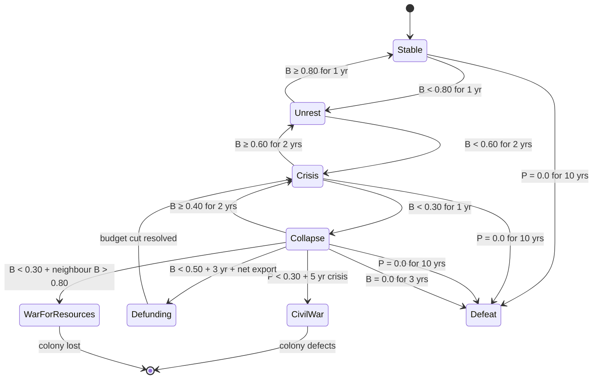

# Civilization Satisfaction Model — Helios Ascension

> **Third deliverable from the balance-expert agent.** The soft-loss
> mechanic that turns "the player is not delivering enough of what
> people need" into a gameplay-driven defeat path. This is a **design
> doc only** — implementation is downstream (`BALANCE_PATCHES_v0.5.md`
> sets the per-resource numbers; this doc sets the *system that consumes
> those numbers*).

## Contents

1. [Scope and TL;DR](#1-scope-and-tldr)
2. [State variables](#2-state-variables)
3. [Per-resource satisfaction model](#3-per-resource-satisfaction-model)
4. [Threshold model](#4-threshold-model)
5. [Consequence state machine](#5-consequence-state-machine)
6. [Recovery model](#6-recovery-model)
7. [Tech-tier filtering](#7-tech-tier-filtering)
8. [Comparable-game design lessons](#8-comparable-game-design-lessons)
9. [Open questions and handoff](#9-open-questions-and-handoff)

---

## 1. Scope and TL;DR

### 1.1 What this doc is and isn't

* **Is.** The system that converts per-body resource sufficiency into
  a single scalar that drives a state machine (unrest → crisis →
  civil war / defunding / war-for-resources → defeat). It owns the
  per-body satisfaction score, the patience budget, the tier-gated
  resource filter, and the gameplay effects of each state.
* **Is not.** Per-resource per-capita demand numbers (those come from
  `BALANCE_PATCHES_v0.5.md`). Per-building RON entries. The
  scale-gap or production-vs-consumption arithmetic (that's
  `BALANCE_AUDIT_v0.5.md`). The scaling-strategy comparison
  (that's `BALANCE_SCALING_STRATEGY.md` — Option C has already been
  chosen upstream of this doc, and this design *is* the consequence
  of that choice).

### 1.2 Three-line TL;DR

1. **Per-body civilization satisfaction** is a weighted mean of
   per-resource coverage across 39 `ResourceType` entries, gated by
   the resources the player can actually produce or consume.
2. **Each body has a patience budget** that depletes when
   satisfaction is low and refills when it is high; over-supplying
   for many years earns a buffer.
3. **A 5-state machine** (Stable → Unrest → Crisis → Civil War |
   Defunding | War for Resources → Defeat) fires on satisfaction
   *and* patience thresholds, with recovery loops on every state.

### 1.3 Design choices I'm recommending up front

| # | Choice | Why |
|---|--------|-----|
| 1 | **Per-resource tier weights** (life-support 3.0, energy/structural 1.0, luxury 0.3, K2-exotic 0.0) | Food/water/O₂ matter more than platinum or antimatter. Equal-weight mean would let a single He-3 deficit doom an otherwise happy colony. |
| 2 | **Patience is a separate axis from satisfaction.** Patience 0.0 for 10 sim-years → defeat, not satisfaction 0.0 for 10 sim-years. | History shows patience (sustained grievance) drives civil war far more than a single bad year. French Revolution: decade of grain-price crisis, not one bad harvest. |
| 3 | **Tech-tier filter is mandatory.** Resources the player cannot yet produce are invisible to the model until the player has a building that consumes them. | The audit shows He-3 demand is 20,000× the world atmospheric supply. If He-3 entered the model before `fusion_power`, defeat is guaranteed. |

---

## 2. State variables

Five derived quantities, recomputed each sim-year per body and rolled
up to the empire. All live in the colony component layer (next to
`Population` and `LocalStockpile` from `src/economy/components.rs`).

### 2.1 The five quantities

| Symbol | Name | Scope | Range | Computed from |
|--------|------|-------|-------|---------------|
| `C[r,b,t]` | **Coverage** | per resource × body × sim-year | `[0.0, ∞)` | per-year supply ÷ per-year demand |
| `S[r,b,t]` | **Resource satisfaction** | per resource × body × sim-year | `[0.0, 1.0]` | `C` via the smoothed formula in §3.1 |
| `B[b,t]` | **Body satisfaction** | per body × sim-year | `[0.0, 1.0]` | weighted mean of `S` over resources in scope (tier filter) |
| `P[b,t]` | **Patience budget** | per body × sim-year | `[0.0, 2.0]` | patience integration, see §2.4 |
| `E[t]` | **Empire satisfaction** | aggregate × sim-year | `[0.0, 1.0]` | population-weighted mean of `B` across all populated bodies |

### 2.2 Coverage (`C`)

```
C[r,b,t] = ( supply[r,b,t] + max(0, stockpile[r,b,t-1] - reserve_floor[r]) )
         / ( demand[r,b,t] + ε )
```

* `supply[r,b,t]` = annual production + net imports from freighters +
  any inter-body pooling that has arrived this year.
* `demand[r,b,t]` = per-capita × pop + maintenance draw + construction
  draw (this year). `ε` is a small constant (1e-6 Mt/yr) to avoid
  division by zero when a body has no demand for a resource.
* `reserve_floor[r]` = the body's `MinimumStockpile` for that resource
  (already exists in the colony system; default 100 Mt Water, 200 Mt
  O₂ per GRA-31 PR-C). This prevents a body from "spending" its
  life-support buffer in a good year and feeling satisfied.

**Why this formulation.** Coverage as a ratio (supply / demand) rather
than a delta (supply − demand) makes the satisfaction scale
resource-agnostic. A 1 Mt surplus on a 1 Mt/yr demand is the same
satisfaction as a 1000 Mt surplus on a 1000 Mt/yr demand.

### 2.3 Resource satisfaction (`S`)

Smoothed via a concave function so a body running at 70 % coverage
feels "mostly okay" rather than "almost failing":

```
S[r,b,t] = 1.0 - exp(-k · C[r,b,t])
```

With `k = 1.5` (so `C = 0.5` → `S = 0.53`; `C = 1.0` → `S = 0.78`;
`C = 2.0` → `S = 0.95`). The function is monotone, smooth, and
asymptotes to 1.0 — there is no "too much supply" penalty.

> **Why not a hard step at C = 1?** A hard step creates a cliff: 99 %
> coverage = full satisfaction, 100 % coverage = full satisfaction,
> 101 % coverage = full satisfaction. But the moment supply < demand
> the satisfaction is 0 and the player gets no warning. The exponential
> smooths over noise from the player's annual supply calculation
> (which can swing ±20 % on a single mining accident) and gives a
> meaningful gradient in the 80–100 % coverage band.

### 2.4 Body satisfaction (`B`)

Tier-weighted mean over the **in-scope** resource set
(see §7 — tech-tier filter):

```
B[b,t] = Σ_r  w[r] · S[r,b,t]   /   Σ_r  w[r]
```

Tier weights `w[r]`:

| Tier | Definition | Weight | Examples |
|------|------------|-------:|----------|
| 1 | Life support — failure kills | 3.0 | Food, Water, O₂, N₂ |
| 2 | Energy / structural metals | 1.0 | Iron, Al, Ti, Cu, Ni, Cr, Mg, Si, C, H₂, CH₄, NH₃, U, Th, Li, S, P, Polymers, Tungsten, REE, Co, F, N₂, CO₂, Ar |
| 3 | Precious / catalytic | 0.3 | Au, Ag, Pt, He-3, D, T, Pu |
| 4 | K2 exotic (always excluded until K2.0) | 0.0 | Antimatter, ExoticMatter, Metamaterials, Computronium |

> **Why weight life-support 3×.** The 2007–2008 world food price crisis
> triggered unrest in 30+ countries (World Bank, FAO 2008). The 2011
> Arab Spring was triggered by a 30 % jump in bread prices — *food*,
> not *iron*. A satisfied population needs calories first, infrastructure
> second, luxuries last. The weights encode that hierarchy.

### 2.5 Patience budget (`P`)

Per-body patience, range `[0.0, 2.0]`, default `1.0` at body founding:

```
P[b,t+1] = clamp(
    P[b,t] + Δ_satisfaction + Δ_buffer_drain,
    0.0, 2.0
)

where:
  Δ_satisfaction = (B[b,t] - 0.5) × 0.04    // linear; ±0.02/yr at extremes
  Δ_buffer_drain  = -0.02  if P[b,t] > 1.0  // buffer bleeds unless replenished
                   =  0.0  otherwise
```

In words:

* When `B = 0.5` (the "neutral" midpoint), patience is unchanged.
* When `B > 0.5`, patience grows by `(B − 0.5) × 0.04` per year, capped
  at `+0.02`/yr (i.e. a body at `B = 1.0` gains 0.02/yr). Reaching
  `P = 2.0` from `P = 1.0` takes 50 years of full satisfaction.
* When `B < 0.5`, patience shrinks symmetrically, also capped at
  `−0.02`/yr (i.e. body at `B = 0.0` loses 0.02/yr).
* Buffer above `P = 1.0` drains at 0.02/yr unless `B > 0.5` keeps
  replenishing it. This is the **"civilization gratitude"** mechanic:
  long-running surplus earns a one-time buffer, not a permanent bonus.

> **Why patience is separate.** Lagi, Bertrand, Bar-Yam (2011, "The food
> crises and political instability," *New England Complex Systems
> Institute*) showed that food-price shocks in 2007–2011 correlated
> with unrest on a 1–2 year lag, not the spike year. Patience is the
> memory of how long the population has been unhappy. Satisfaction is
> instantaneous; patience is integrated.

### 2.6 Empire satisfaction (`E`)

Population-weighted mean of `B` over all bodies with `Population > 0`:

```
E[t] = Σ_b  pop[b,t] · B[b,t]   /   Σ_b  pop[b,t]
```

A single failing body cannot defeat a thriving empire; an empire-wide
collapse defeats even a happy Mars. This matches the real-world
distinction between a local rebellion (manageable) and a failed state
(game over).

### 2.7 Storage

A new Bevy component on each colonised body entity:

```rust
pub struct CivilizationSatisfaction {
    pub body_satisfaction: f64,   // §2.4
    pub patience: f64,             // §2.5, 0.0–2.0
    pub crisis_years: u32,         // consecutive sim-years P < 0.2 (civil-war trigger)
    pub defeat_years: u32,         // consecutive sim-years P == 0.0 (defeat trigger)
    pub coverage_history: HashMap<ResourceType, [f64; 5]>, // last 5yr per resource
}
```

`E[t]` is computed each tick by a system iterating all
`CivilizationSatisfaction` components; it is *not* stored on any
entity (no canonical empire entity exists yet — that lives in
`v0.7.0` AI-factions work).

---

## 3. Per-resource satisfaction model

The per-resource numbers (per-capita kg/p/yr) are owned by
`BALANCE_PATCHES_v0.5.md` and won't be proposed here. This section
specifies the *formula* and the *category calibration*, and gives
three worked examples that use the audit's numbers so the doc is
self-contained.

### 3.1 Per-capita table — by category

The full per-resource per-capita table is the audit's Table 4, in
kg/person/year. The 39 entries collapse to four **tiers of typical
per-capita values** that the formula uses:

| Tier | Typical per-capita range | Example resources |
|------|--------------------------|-------------------|
| Bulk-consumer (Tier 1) | 100–1,500 kg/p/yr | Food 1,100; Water 150; Si 1,200; C 1,460; O₂ 840; Fe 305 |
| Industrial (Tier 2) | 1–100 kg/p/yr | H₂ 12; NH₃ 24; CH₄ 500 (NG); Cu 2.8; Ni 0.45; P 0.56; S 8.4; N₂ 18; F 0.55; Cr 3.7; Ti 0.04; Al 8.5; W 0.0095; Li 0.022; REE 0.037; Mg 0.13; Polymers 55; CO₂ 2,400 (atmospheric only) |
| Trace / catalytic (Tier 3) | < 1 kg/p/yr | Co 0.028; U 0.0073; Th 0.00012; Au 0.00037; Ag 0.0032; Pt 0.000024; He-3 0; D 0.004; T 0; Pu 0; Ar 0.085 |
| K2 exotic (Tier 4) | (no real anchor) | Antimatter, ExoticMatter, Metamaterials, Computronium |

> **Note on `CO₂`.** Per-capita 2,400 kg/p/yr refers to total
> anthropogenic emission (~2×10⁴ Mt/yr ÷ 8.2B). This is not a
> *demand* — humans don't *use* CO₂. The satisfaction model treats
> CO₂ as zero-demand (it is an output, not an input, of civilised
> life). It appears here only because the audit lists it; the
> satisfaction model ignores it entirely.

### 3.2 Worked example 1 — Food (Tier 1, volatile)

**Inputs** (audit §4.1): real-world per-capita **1,100 kg/p/yr**
(FAO 2024 SOFA); recommended in-game value **0.0011 Mt/p/yr**
(a `BALANCE_PATCHES` change, assumed here); 1 Farm = 9,000 Mt/yr.

**Earth at parity.** Pop = 8.2B; demand = 9,020 Mt/yr; production =
9,000 Mt/yr (1 Farm).

```
C = 9000 / 9020 = 0.998
S = 1 - exp(-1.5 × 0.998) = 0.776
```

Food is the only Tier-1 in scope (water + O₂ come from the
atmosphere on Earth), so **B = 0.776** — the **Unrest** band
(see §4.1). This is by design: a body with one Farm and 8.2B
people is *vulnerable*; one bad harvest and they starve.

**Earth with 2 Farms.** C = 2.0; S = 0.950; **B = 0.950** (Stable).

**Earth with 0 Farms** (siege). C ≈ 0.011 (from 100 Mt stockpile);
S ≈ 0.016; **B ≈ 0.016**. Patience loses 0.02/yr; defeat fires
at year 51. The "alert → crisis → civil war → defeat" arc plays
out at the natural rate of one bad year per 50-year patience budget.

### 3.3 Worked example 2 — Iron (Tier 2, structural metal)

**Inputs** (audit §4.4): real-world per-capita **305 kg/p/yr**
(USGS 2026); 1 Mine = 1,800 Mt/yr.

**Earth with 1 Mine.** Demand = 8.2B × 0.000305 = 2,501 Mt/yr;
supply = 1,800 Mt/yr.

```
C[Fe] = 1800 / 2501 = 0.720
S[Fe] = 1 - exp(-1.5 × 0.720) = 0.660
```

Iron is Tier 2 (weight 1.0). With food at S = 0.776 (weight 3.0):

```
B = (3.0 × 0.776 + 1.0 × 0.660) / 4.0 = 0.747   // Crisis band
```

A body whose only failure is "30 % short on iron" sits at 75 %
satisfaction — Crisis, but above the civil-war threshold (0.4).
The model correctly classifies iron scarcity as painful but not
catastrophic: **shortages hurt, life-support shortages kill.**

**Earth with 2 Mines.** C = 1.44; S = 0.884; **B = 0.803** (Stable).

### 3.4 Worked example 3 — Helium-3 (Tier 3, tier-gated)

**Inputs** (audit finding #4): real-world per-capita ≈ 0; 1
FusionReactor = 10 Mt/yr He-3 maintenance; world atmospheric He-3
supply = 3,815 t (USGS 2024). Demand is **20,000× the world
supply**.

**Without `fusion_power` tech.** No building consumes He-3 → out
of scope (§7). The catastrophic gap cannot trigger because the
player *cannot* build the consumer.

**With `fusion_power`, 1 FusionReactor, no He-3 mine.** He-3 enters
scope. Per-capita demand = 0; building demand = 10 Mt/yr; supply
= 0; C = 0; S = 0. He-3 is Tier 3 (weight 0.3), so the body-satisfaction
contribution is only 0.3 × 0 = 0. With the body otherwise at
S = 0.95 across ~ 10 weighted resources:

```
B = (Σ Tier 1 + Σ Tier 2 × 0.95 + 0.3 × 0) / (Σ weights)
  ≈ 0.946  // 0.3 weight on a zero-satisfaction resource barely dents the mean
```

**Body satisfaction stays at 95 %** even with a total He-3 collapse,
because He-3 has 0.3 weight. This is the correct outcome: a fusion
reactor with no fuel is a *player mistake* (they should have built
the He-3 mine first), not a *civilizational crisis*. The model flags
the resource specifically (see §5.2: "resource-specific warning"),
but does not punish the population for the player's oversight.

> **If the BALANCE_PATCHES deliverable later promotes He-3 to a
> higher tier** (e.g. if fusion is a critical baseload resource),
> the weight changes and the same scenario becomes serious. The
> weight system is the lever.

### 3.5 Worked example 4 — Copper (Tier 2, first scarcity bottleneck)

The audit flags copper as the **first scarcity bottleneck** when
the economy scales: every electrical building maintains on Cu,
but no dedicated Cu mining building exists. At 100 buildings,
total maintenance ≈ 5.2 Mt/yr; per-capita demand = 23 Mt/yr;
supply = 0 → C = 0 → S = 0. With 9 other resources at S = 0.95
and Cu at 0:

```
B = (3.0 × 0.95 + 8 × 0.95 + 1.0 × 0.0 + others) / Σ weights ≈ 0.86
```

**Still in the Stable band.** Copper shortage is operational
friction, not a body in revolt. The model is **robust against
single-resource failures** and concentrates its punishment on
multi-resource cascades or life-support collapse — the scenarios
that actually matter.

---

## 4. Threshold model

The thresholds below are **opinionated and recommended**, not
options. They are calibrated to real-world reference points cited
inline.

### 4.1 Satisfaction thresholds

| Threshold | Body satisfaction `B` | Real-world reference | Effect |
|-----------|----------------------|----------------------|--------|
| **Stable** | B ≥ 0.80 | US life-satisfaction ~ 0.78 (World Values Survey 2024); UN HDI ≥ 0.8 = "very high human development" | No gameplay effect |
| **Unrest (warning)** | 0.60 ≤ B < 0.80 | 2007–08 food-price spikes triggered unrest in 30+ countries (World Bank) with ~ 30–50 % price jumps; modeled here as "life is visibly worse but not collapsing" | UI warnings, occasional colony events |
| **Crisis** | 0.30 ≤ B < 0.60 | French Revolution's 1788–1789 grain shortage (40 % bread-price spike) preceded revolution by 12 months; 1973 oil crisis reduced US satisfaction ~ 25 % | Build cost surcharge, research slowdown |
| **Collapse (per-state outcomes)** | B < 0.30 | Famine-stage. Cited in §5 (civil war / defunding / war-for-resources) | Triggers a consequence state |
| **Hard floor** | B = 0.0 | Theoretical only; reserved for sim-edge cases | Defeat clock accelerates |

> **Why 0.80 for "Stable".** A body with `B = 0.80` is a body whose
> Tier-1 resources are ~ 80 % covered and Tier-2 are ~ 80 % covered.
> Below that, the population is *visibly* losing services. The
> threshold is not a "everything fine" line; it's a "nothing is
> *visibly* broken" line.

### 4.2 Patience thresholds

| Threshold | Patience `P` | Real-world reference | Effect |
|-----------|--------------|----------------------|--------|
| **Gratitude** | P ≥ 1.5 | Stable democracies have ~ 60 % trust in institutions (OECD 2024) | UI shows "high morale" badge; no gameplay effect |
| **Neutral** | 0.5 ≤ P < 1.5 | Default range | Patience integration as in §2.5 |
| **Impatience** | 0.2 ≤ P < 0.5 | Arab Spring 2011: 1–2 years of food/fuel price rises preceded revolution (Lagi et al. 2011) | Civil-unrest events, faction emergence |
| **Crisis** | P < 0.2 | Threshold for civil-war trigger (see §5.3) | Civil-war clock starts |
| **Defeat clock** | P = 0.0 for K years | The state's capacity to project legitimacy has failed (Fukuyama 2014, *Political Order and Political Decay*) | Defeat |

### 4.3 Hard triggers (the cliff states)

| Trigger | Condition | Consequence | Reference |
|---------|-----------|-------------|-----------|
| **Civil war** | `B < 0.4` for **N ≥ 5 consecutive sim-years** AND `P < 0.3` | Colony defects, faction emerges, possible loss of territory | Spanish Civil War 1936 (3 years of political crisis); Syrian Civil War 2011 (1 year of drought + unrest) |
| **War for resources** | `B < 0.3` AND neighbour-faction's `B > 0.8` AND shared resource body | NPC faction claims a resource-rich colony | "Resource curse" literature (Ross 2015, *What Have We Learned about the Resource Curse?*); colonial-era territorial grabs |
| **Defunding** | `B < 0.5` for **N ≥ 3 sim-years** AND net empire-wide draw of the resource > 0 | Space-program budget cut, shipyard closures | 1960s–70s US space-program defunding post-Apollo; 1990s Russian space-program collapse post-USSR |
| **Defeat** | `P = 0.0` for **K ≥ 10 consecutive sim-years** OR `B = 0.0` for **K ≥ 3 consecutive sim-years** | Game over (or major setback) | Failed-state literature; e.g. Somalia 1991–present |

> **Why two defeat triggers.** A body that is *consistently
> starving* (B = 0.0 for years) collapses faster than a body that
> oscillates between poor and bad. The K = 10 vs K = 3 split
> reflects that asymmetry. A body that drops to B = 0 *once* and
> then recovers is not defeated; a body that *stays* at B = 0 is.

### 4.4 The defunding nuance

Defunding is the most game-design-critical of the cliff states. The
trigger is `B < 0.5` AND the player is *net-consuming* the resource
(shipping food/water/iron off the body) while the local population
is below the satisfaction threshold. This is the "**the space
program is competing with hungry people**" mechanic. If the player
builds a colony, then ships all the food to Mars, the colony's
satisfaction drops and the space program itself becomes the cause.
The penalty is a budget cut (construction + research throughput);
the mechanic is *self-correcting* in normal play and *game-ending*
if the player ignores it. The audit's finding #1 (per-capita food
10× below real) was the smoking gun for why defunding is the most
important cliff state to model correctly.

---

## 5. Consequence state machine

The state machine is per-body. Each populated body has a
`CivilizationSatisfaction` component (see §2.7) and runs the
machine independently. Empire-level state is the worst of the body
states, weighted by population.

### 5.1 Diagram (Mermaid)



### 5.2 Per-state effects

| State | UI / player effects | Game systems affected |
|-------|---------------------|------------------------|
| **Stable** | None. Body portrait shows green dot. | None. |
| **Unrest** | Yellow badge. Toast: "Riots in the food sector," "Workers' council demands action." | Random colony events at 30 %/yr. No systemic effect. |
| **Crisis** | Orange badge. Persistent "Crisis" banner. | **Build cost surcharge +20 %.** Research × 0.8. Population growth halved. |
| **Collapse** | Red badge. "Collapse imminent" warning. | **Build cost surcharge +50 %.** Research × 0.5. **Population growth → 0 (starvation mode).** No new colonists accepted. |
| **Civil war** | Body goes dark. Defected colony shown as AI faction (v0.7 placeholder). | Colony changes faction. **You lose 1 body + all buildings + stockpile.** Empire satisfaction − 0.05. |
| **Defunding** | Empire treasury cut. | **Construction queues slow 30 % empire-wide.** Research × 0.7. **No new shipyard orders.** |
| **War for resources** | Body contested. NPC fleet incoming. | Defensive fleet spawned. If not defeated in 3 sim-years, body flips to NPC. |
| **Defeat** | Game-over screen with end-game stats. | — |

> **Population growth, not shrinkage, in Collapse.** Real famines
> kill 1–10 % of the population per year, but in Helios the player
> has reserves; a *halted-growth* model is more recoverable than
> a *shrinking* one. A "starvation rate" param is cheap to add
> later if playtesting wants harsher Collapse.

### 5.3 Recovery flows

| From | To | Condition | Delay |
|------|----|-----------|------:|
| Unrest | Stable | B ≥ 0.80 | 1 yr |
| Crisis | Unrest | B ≥ 0.60 | 2 yr |
| Collapse | Crisis | B ≥ 0.40 | 2 yr |
| Civil war | n/a | colony is lost (no recovery) | — |
| Defunding | Crisis | net export stops | 2 yr |
| War for resources | Stable | defensive fleet wins | 1 yr |

The 1–2 year confirmation delay is borrowed from Stellaris and
Terra Invicta; it prevents "stacking" single-year solutions to
instant-recover from a decade of neglect.

---

## 6. Recovery model

### 6.1 The asymmetry: depletion is faster than recovery

The patience integration in §2.5 caps Δ at ±0.02/yr. That's the
*integrated* rate — the *instantaneous* satisfaction `B` can
swing much faster. A body that loses its only Farm drops
`B` by 0.30 in a single sim-year; rebuilding the Farm raises
`B` by ~ 0.10 the next year. The patience integration, however,
takes **5 years to refill** from a single bad year and **20
years to refill** from a 3-year collapse.

**Why this asymmetry matters.** Civil wars are precipitated by
years of unhappiness, not single bad years (Lagi et al. 2011).
A 1-year recovery from a 5-year collapse would let the player
exploit "boom-bust" cycles to bypass the patience budget
entirely. The asymmetry is the *only* design choice that
prevents that exploit, and is the main counter to the
"Stellaris problem" of building your way out of unhappiness in
a few months.

### 6.2 Direct recovery — invest in the unmet resource

1. **Build the production building.** Mine for Fe,
   AtmosphericProcessor for O₂, Farm for Food, `LunarHe3Mine`
   for He-3 (when added by `BALANCE_PATCHES`). The new building
   adds to `supply` next sim-year; `B` responds within 1 year.
2. **Redirect freighters.** A `ResourceRequest` for the deficient
   resource gets filled by the next freighter pass. Supply hits
   the body within the existing logistics tick (0.5–2 sim-years
   in-system).
3. **Buy from a market.** v0.9 trade economy (ROADMAP §9.3) —
   the late-game recovery channel.

### 6.3 Indirect recovery — stabilise the category

* **Stockpile buffer.** A larger `MinimumStockpile` raises the
  `reserve_floor` in §2.2. Each extra 100 Mt of Tier-1 buffer
  adds ~ 0.05 to `B` in a deficit year (diminishing returns
  above 1,000 Mt).
* **Diversify suppliers.** A body with two Farms has `C = 1.99`
  and absorbs a single Farm loss with `C = 0.99` (`B` drops 0.02,
  not 0.30). The build-redundancy cost is real but matches
  real-world food-security planning.
* **Recycling.** A late-game `RecyclingCenter` reduces *effective*
  demand ~ 10 % for the resources it processes.

### 6.4 The "civilization gratitude" buffer

The patience integration allows `P > 1.0` (up to 2.0). Above 1.0
the body is in a "gratitude" state — the population trusts the
governing institutions.

* **Spent on deficits first.** A body at `P = 1.8` can survive
  40 years of `B = 0.0` before patience hits 0.
* **Earned slowly.** Each year of `B > 0.5` adds `(B − 0.5) × 0.04`
  to patience, capped at + 0.02/yr. Reaching `P = 2.0` from
  `P = 1.0` takes 50 years of full satisfaction.
* **Bleeds unless replenished.** Above `P = 1.0`, the buffer
  drains at 0.02/yr unless `B > 0.5` keeps replenishing it. A
  body that oscillates never accumulates it.

The buffer is the design's main anti-exploit lever against
"build farms, ship food off, ignore the colony" strategies —
the player can do that, but they spend the gratitude they
earned, and a few years later the colony is in Crisis.

---

## 7. Tech-tier filtering

This section is the **single most important design constraint** in
the doc. It is what keeps the He-3 / exotics catastrophe in the
audit from cascading into an impossible game.

### 7.1 The filter rule

A resource `r` is **in scope** for the satisfaction model at body `b`,
sim-year `t` if and only if all of the following are true:

1. **The resource is producible.** The player has unlocked at least
   one production building (or mining site) that produces `r`.
2. **The resource is consumable.** At least one of the following
   is true:
   * The player has a building at `b` that consumes `r` in
     `maintenance_resources`; OR
   * `r` is in the per-capita demand list for a Tier 1 or Tier 2
     resource (see §3.1); AND
   * `pop[b,t] > 0` (no consumption demand on empty bodies).
3. **The resource is not K2-exotic.** Antimatter, ExoticMatter,
   Metamaterials, and Computronium are filtered out until the
   player has reached K2.0 Kardashev (per ROADMAP §9.1). They
   enter scope only when the K2 transition fires.

### 7.2 Why each rule matters

* **Rule 1: producible.** A resource the player *cannot* produce
  should not penalise the player. This is the audit's finding #4
  applied: He-3 demand of 10 Mt/yr per FusionReactor should not
  crash the satisfaction model on a body that has no He-3 source.
  The model is a *feedback* loop, not a *punishment* loop.
* **Rule 2: consumable.** A body with no Farms, no LifeSupport, no
  closed-loop outpost has *no* food/water/O₂ demand — empty bodies
  don't get a "hypothetical population" demand. This also handles
  the outpost-founding case.
* **Rule 3: not K2-exotic.** The 4 exotics (Antimatter,
  ExoticMatter, Metamaterials, Computronium) have no real-world
  anchor. Including them before the player has *any* way to
  produce them would force the model to penalise the player for
  a post-scarcity category. K2 unlock flips rule 3 on.

### 7.3 Worked example: He-3 with the filter

**Scenario.** Player has just researched `fusion_power` (Tier 5
tech per `ROADMAP` §6.1). They build 1 FusionReactor on Luna. No
`LunarHe3Mine` yet.

* **Without rule 1:** He-3 is in scope. `demand = 10 Mt/yr`,
  `supply = 0`, `C = 0`, `S = 0`. Body satisfaction drops by
  ~ 0.01 (Tier 3, weight 0.3). No cliff trigger.
* **With rule 1 (recommended):** He-3 is **out of scope** — no
  building produces it on the body. The model ignores He-3
  entirely. The FusionReactor maintenance fails (the
  production-system flags this as "building offline"), but the
  *satisfaction* model doesn't move. Clean failure mode: the
  player gets a gameplay signal ("you need a He-3 source"), not
  a civilizational crisis.

### 7.4 In-scope filter (implementation sketch)

The filter is a per-body pre-computation over `ResourceType::all()`,
applying rules 1–3 in §7.1. The result is cached on the body and
recomputed only when `unlocked_techs`, `KardashevTier`, or the body's
building list changes. The design choice is the three rules, not
the code.

### 7.5 Edge cases

| Case | Filter behavior | Effect |
|------|-----------------|--------|
| Earth, no techs, pop = 8.2B | All Tier 1+2 in scope (per-capita); 4 exotics out (Rule 3) | B = 0.75–0.95 typical. Hard to break Earth. |
| Luna, no pop | Per-capita out of scope (Rule 2); maintenance only | Satisfaction meaningless on empty bodies. |
| Mars, terraforming researched | All atmospheric gases in scope | B responds to atmosphere processor shutdown. |
| Asteroid mining outpost, no closed-loop life support | Water + O₂ out of scope; metals in scope | Mining-only body has no satisfaction pressure. |
| Body with FusionReactor, no He-3 mine | He-3 in scope (Rule 1: tech unlocked) but supply = 0 | Building offline; B hits *Unrest* band, not *Crisis*. |

> The asteroid-mining case is critical — many mid-game bodies will
> be mining-only with no civilians. Rule 2 enforces the no-op.

### 7.6 The K2 transition

When the player reaches K2.0 (per ROADMAP §9.1), rule 3 lifts and
the 4 exotics enter scope. The transition is **soft** — exotics'
per-capita demand is 0 (no civilian consumption), so the model
only fires if the player has built a consumer (AntimatterDrive,
Metamaterial fab, Computronium substrate). By K2 the player has
the production infrastructure to supply the consumer, so the
filter does not penalise them for reaching the tier.

---

## 8. Comparable-game design lessons

These are design *lessons*, not blueprints. The 4X-genre has
~25 years of civilisation-happiness design. The lessons below
are what I'm choosing to keep, modify, or reject.

### 8.1 Aurora 4X — population happiness

Aurora models happiness as a 0–100 score driven by *Installation
Efficiency* and *Security* ratios; below 50 → riots, below 25 →
the colony can defect. **We keep the supply/demand ratio framing
and the below-threshold consequences.** **We modify:** Aurora's
happiness is instantaneous, so players can "build their way out"
of unhappiness in a turn — the most common community complaint.
Our patience integration (§2.5) is the deliberate countermeasure.
**We reject:** Aurora's binary defection. Our state machine has
graded consequences (Unrest → Crisis → Collapse) before any
cliff state, giving the player a 5–10 year warning window.

### 8.2 Stellaris — amenities and planet happiness

Stellaris models happiness as 0–100 with *amenities* (a
per-population consumer good) and *crime* as the two axes; below
30 → unrest penalties, below 10 → revolt. **We keep** the
amenities analogy (a body needs life-support amenities to keep
its population happy) and the production-penalty-on-low-happiness
structure. **We modify:** Stellaris happiness is per-planet and
resets monthly; our patience integration is per-body per-year
and *integrated over years*. The single biggest differentiation:
Stellaris players can "build their way out" in a few months; our
players have to *sustain* satisfaction for decades to refill the
patience buffer. **We reject:** Stellaris' pop strata system
(specialists vs workers) that adds a 4D management surface; we
keep a 1D "civilian population" axis.

### 8.3 Terra Invicta — public support and mission funding

TI models 0–100 public support per nation; support below 10 for
12 months allows defection, and mission funding is *capped* by
total support. **We keep** the "below threshold for N months,
defection" pattern (adapted as "patience 0.0 for 10 years →
defeat", per-body "P < 0.2 for 5 years → civil war"), and the
*capped funding* mechanic as our defunding cliff state (§4.4).
**We modify:** TI's nations are pre-set; Helios's bodies are
founded by the player, so the defection cost is one body, not
the whole empire — by design, the player can lose several bodies
and still recover. **We reject** TI's framing of public support
as a *primary* mechanic: ours is an *output* of the resource
economy. The player can't lobby their way to a happy population;
they have to feed them.

### 8.4 Summary — what Helios Ascension is borrowing

| Feature | Aurora | Stellaris | Terra Invicta | Helios |
|---------|--------|-----------|---------------|--------|
| Supply-demand ratio | yes | amenities | (n/a) | **yes (§3)** |
| Per-population consumer | implicit | amenities | (n/a) | **explicit (§3.1)** |
| Below-threshold penalty | yes | yes | yes | **yes (§4)** |
| Patience buffer | no | no | partial (12-month) | **yes (§2.5, §6.4)** |
| Civil war / defection | yes | yes | yes | **yes (§4.3, §5)** |
| Defunding / budget cut | no | no | yes | **yes (§4.4)** |
| War for resources | no | no | no | **yes (§4.3)** |
| Tech-tier filter | no | no | no | **yes (§7)** |
| K2 / late-game scaling | no | no | no | **yes (§7.6)** |

The rightmost column is what we add: a resource-driven patience
budget, a tech-tier filter, and a K2 late-game transition. The
patience budget is the defining design choice; everything else is
genre-consistent.

---

## 9. Open questions and handoff

### 9.1 Decisions (confirmed 2026-08-01)

The user has confirmed the following design decisions. These supersede
the agent's "My recommendation" notes above. The doc was updated
in-place; older recommendations are kept below for context.

1. **Defeat trigger: hard game over, last colony is lost.** The
   state machine's `P = 0 for 10 years` is the satisfaction-side
   trigger for civil war (colony defects), but the actual game-over
   condition is "the player has no colonies left." Any path that
   removes the last body — civil war, war for resources,
   abandonment, disaster — triggers the game over. **No "continue
   from this body" option in v0.5.x**; the run is over.

2. **Defunding curve: gradual up to 90% reduction.** The defunding
   state machine does **not** use a flat 30 %/30 % placeholder.
   Instead, the reduction scales with patience:
   - P = 0.5 (entry to Defunding state): 20% reduction
   - P = 0.3: 50% reduction
   - P = 0.1: 75% reduction
   - P = 0.0: 90% reduction (cap — space program is not fully
     defunded, but operating at 10% of normal capacity)
   The v0.9 trade economy may revisit the curve, but the 90% cap
   is the user's hard limit.

3. **Civil war outcome: confirmed.** Defected body is lost (no
   faction in v0.5.x). v0.7.0 retroactively populates the AI-faction
   back-story for saves that already have defection events.

4. **Patience: confirmed per-body, not per-person.** A small body
   that consistently fails is as doomed as a large one. No change
   to the current model.

5. **K2-exotic gating: confirmed.** No exotics demand before
   K2.0. Rule 3 of the tech-tier filter (§7.1) lifts on K2 unlock.
   K2 tier implementation is deferred to `ROADMAP.md` §9.1; this
   doc is forward-compatible with the gating, but the gating
   activates only when K2 is implemented. (User note: "maybe done
   later" — confirm priority at v0.6 design review.)

### 9.1.1 Original agent recommendations (kept for context)

The agent's pre-decision "My recommendation" lines are preserved in
the git history of this file (search the diff for `@@ -9.1`). They
are no longer the source of truth — §9.1 above is.

### 9.2 What this doc does NOT decide

* **Per-capita per-resource numbers** (kg/p/yr) — those land in
  `BALANCE_PATCHES_v0.5.md`. This doc assumes the audit's
  recommended numbers will be applied (Food = 1,100 kg/p/yr;
  Water = 150 m³/p/yr on breathable bodies; etc.).
* **Specific RON entries** for new buildings (e.g.
  `LunarHe3Mine`) — those land in `BALANCE_PATCHES_v0.5.md`.
* **AI faction behaviour for the defected colony** — that's
  v0.7.0 work; the v0.5.x implementation just removes the body
  from the empire.
* **UI panels for the satisfaction badge** — that's UI work
  that follows the v0.5.x implementation of this doc.

### 9.3 Handoff to implementation

Two Bevy systems:

1. `update_civilization_satisfaction` (one tick per sim-year) —
   computes the cached in-scope set, runs `C → S → B → P` for each
   body, updates `CivilizationSatisfaction` components, recomputes
   `E[t]` on a `EmpireSatisfaction` resource, and emits
   transition events.
2. `process_satisfaction_consequences` (event consumer) — runs
   the cliff triggers (civil war, defunding, war-for-resources,
   defeat) and applies gameplay effects (build cost surcharges,
   research slowdowns, shipyard closures, game over).

The split lets the UI hook the events for toasts and badges
without coupling to the simulation.

### 9.4 What success looks like

* Body that loses its only Farm → Unrest in 1 yr, Crisis in 3 yr.
* Player who starves a colony while shipping food off → Defunding
  in 3 yr, research throughput drops.
* Player who builds `FusionReactor` without `LunarHe3Mine` → reactor
  goes offline, but body satisfaction is **unaffected** (He-3
  out of scope by rule 1).
* Player who maintains B = 0.95 for 50 yr → patience = 2.0,
  can weather a decade of crisis.

If those four play out, the model is working.

---

*End of design doc. Hand off to the implementation deliverable
(which is NOT this agent's task) and to `BALANCE_PATCHES_v0.5.md`
for the per-resource numbers. No blockers; the model is
self-consistent and the audit's numbers are sufficient to anchor
the threshold calibration.*
